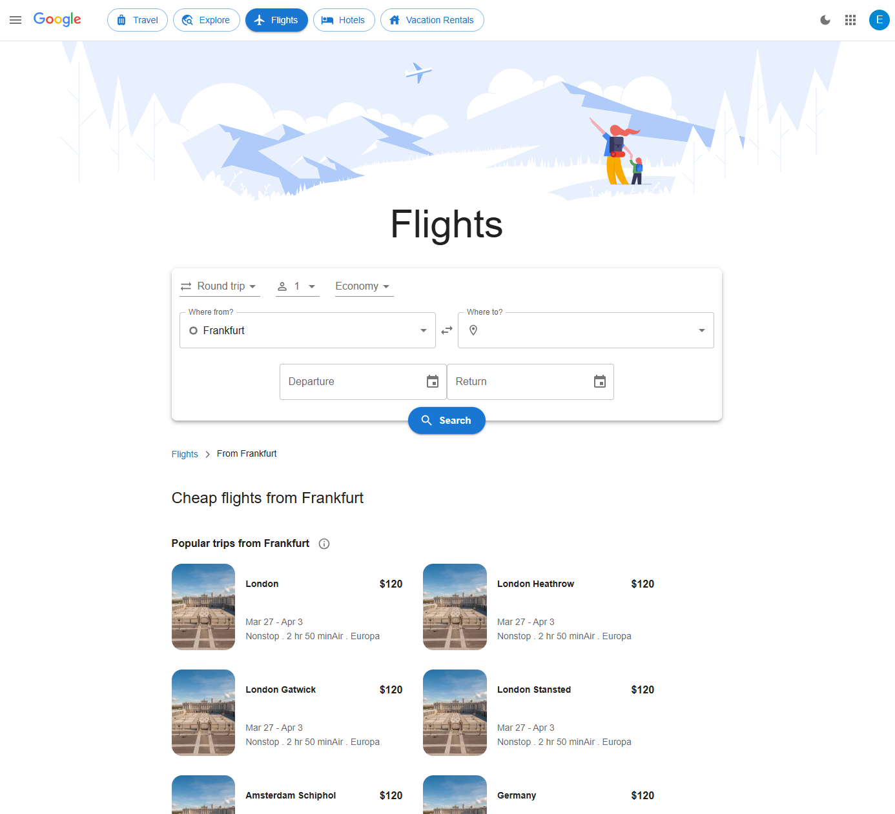

# ReactJS Google Flights App

A simple flight search application built with React.js. This project is a clone of Google Flights, developed as part of a job assessment with a strict one-day deadline. The challenge was to implement as much functionality as possible within the given time constraint.

---

## **Screenshot**



---

## **Live Demo**

You can try out the live demo of this project here: **[Live Demo Link](#)**

---

## **Features**

- **Flight Search**: Users can search for flights by selecting departure and destination locations.
- **Date Selection**: Allows users to choose travel dates for one-way and round-trip flights.
- **Passenger & Class Selection**: Users can specify the number of passengers and travel class.
- **Search Results Display**: Displays available flights based on user input with basic details.
- **Basic Filtering**: Implements limited filtering options for refining search results.
- **Responsive Design**: Optimized for both desktop and mobile devices.

---

## **Technologies Used**

- **React.js**: Built using React for a fast and interactive UI.
- **Material UI**: Utilized for styling and pre-built components.
- **Context API**: Managed state for search parameters.
- **React Router**: Handled page navigation and routing.

---

## **Installation**

### **Using Create React App**

To get started with the project locally using Create React App, follow these steps:

1. Clone the repository:
   ```sh
   git clone https://github.com/EthanEDev/reactjs-google-flights-app.git
   ```
2. Navigate to the project directory:
   ```sh
   cd reactjs-google-flights-app
   ```
3. Install dependencies:
   ```sh
   npm install
   ```
4. Start the development server:
   ```sh
   npm start
   ```

### **Using Vite**

If the project uses Vite instead of Create React App, follow these steps:

1. Clone the repository:
   ```sh
   git clone https://github.com/EthanEDev/reactjs-google-flights-app.git
   ```
2. Navigate to the project directory:
   ```sh
   cd reactjs-google-flights-app
   ```
3. Install dependencies:
   ```sh
   npm install
   ```
4. Start the development server:
   ```sh
   npm run dev
   ```

---

## **Contributing**

Contributions are welcome! If you have suggestions for improvements or find any issues, feel free to open an issue or submit a pull request.

1. Fork the repository.
2. Create a new branch:
   ```sh
   git checkout -b feature-branch
   ```
3. Commit your changes:
   ```sh
   git commit -am 'Add new feature'
   ```
4. Push to the branch:
   ```sh
   git push origin feature-branch
   ```
5. Create a new Pull Request.

---

## **License**

This project is licensed under the MIT License - see the [LICENSE](LICENSE) file for details.

---

## **Contact**

If you have any questions, feel free to reach out via GitHub issues or at **ethan.ekhtiyar@gmail.com**.

